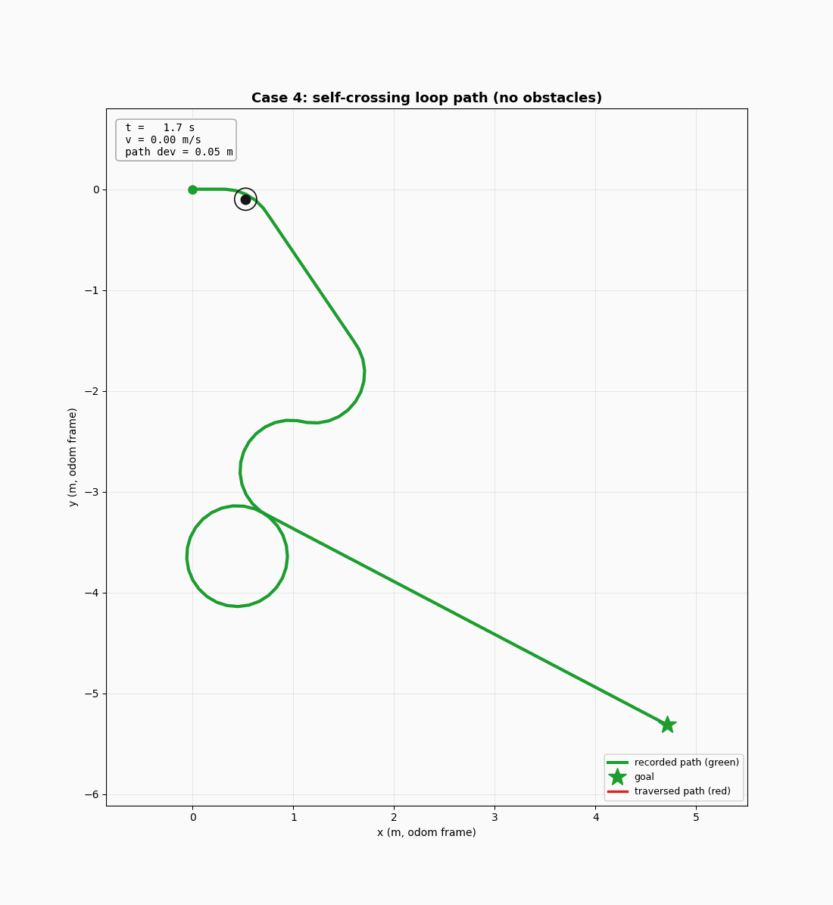
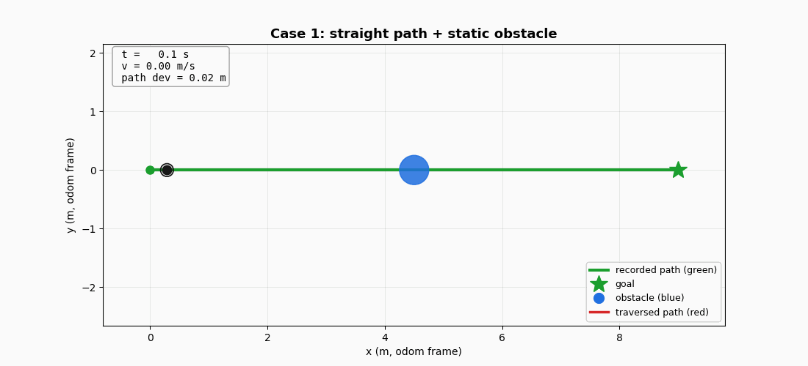
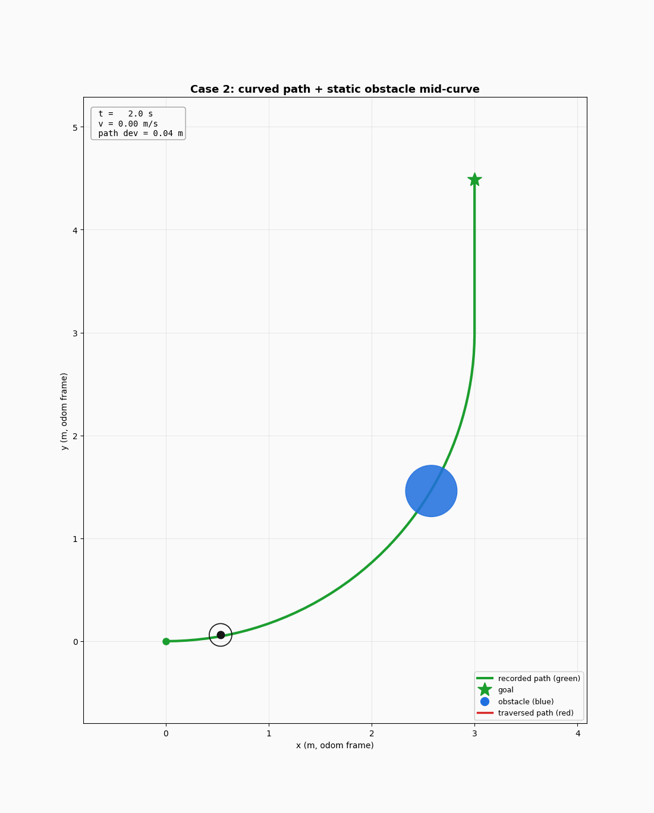
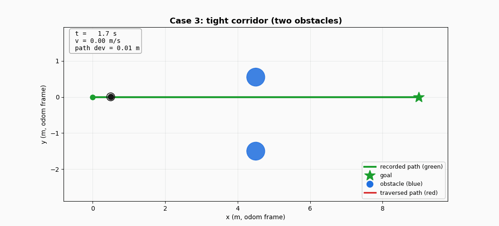
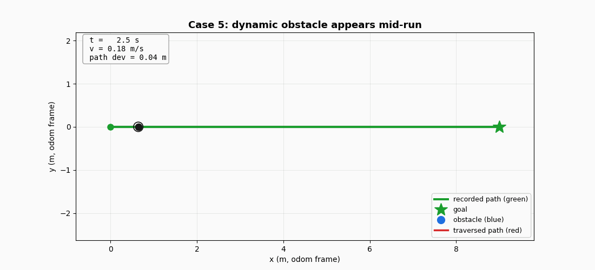
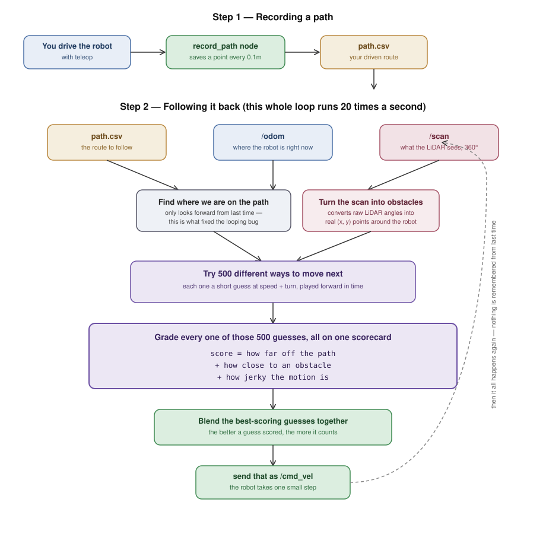

<p align="center">
  
</p>

<h1 align="center">MPPI Trajectory Tracker</h1>

<p align="center">
  
  
  
  
</p>

<p align="center">
A ROS2 MPPI controller that tracks a recorded path and avoids static and dynamic obstacles in real time.
</p>

<details>
<summary>📑 Contents</summary>

- [Demo](#demo)
- [Overview](#overview)
- [Quick Start](#quick-start)
- [Test Results](#test-results)
- [How It Works](#how-it-works)
- [Notes](#notes)
- [Repository Structure](#repository-structure)

</details>

---

## Demo

| Case | Preview | Full video |
|---|---|---|
| **1. Straight + obstacle** |  | [`media/case1.mp4`](media/case1.mp4) |
| **2. Curved + obstacle** |  | [`media/case2.mp4`](media/case2.mp4) |
| **3. Two obstacles flanking the path** |  | [`media/case3.mp4`](media/case3.mp4) |
| **4. Self-crossing loop, no obstacles** |  | [`media/case4.mp4`](media/case4.mp4) |
| **Dynamic obstacle, dropped mid-run** |  | [`media/dynamic_obstacle.mp4`](media/dynamic_obstacle.mp4) |
| **Baseline — no obstacles** | — | [`media/straight_no_obstacle.mp4`](media/straight_no_obstacle.mp4) |

The previews above are plotted replays rendered straight from logged `/odom`, `/scan`, and `/cmd_vel` data — green is the recorded path, red is the actual driven path. The linked `.mp4` files are the full RViz + Gazebo screen recordings.

---

## Overview

This replaces a reference Pure Pursuit controller with an MPPI implementation written from scratch. The main design choice: path-tracking and obstacle avoidance are both terms in one cost function, not two separate behaviors. There's no "avoiding" mode and no "resuming" mode. Every control cycle scores about 500 sampled trajectories against a single combined score, and the detour-and-rejoin behavior comes out of that scoring on its own.

| Component | What it does |
|---|---|
| `record_path` | Logs `(x, y)` from `/odom` to CSV at 0.1m spacing |
| `mppi_tracker` | Loads the CSV, drives the robot along it, avoids obstacles using live 360° LiDAR |

## Quick Start

```bash
# Terminal 1 [simulation]
export TURTLEBOT3_MODEL=burger
ros2 launch turtlebot3_gazebo empty_world.launch.py

# Terminal 2 [RViz]
ros2 run rviz2 rviz2
# Set Fixed Frame to "odom", then Add → By topic:
#   /mppi/recorded_path_marker  (green — recorded path)
#   /mppi/traversed_path_marker (red — actual driven path)
#   /scan, RobotModel

# Terminal 3 [record a path (use teleop to drive)]
ros2 run mppi_tracker record_path --ros-args -p output_file:=/tmp/my_path.csv

# Terminal 4 [track recorded path]
ros2 launch mppi_tracker mppi_tracker_launch.py path_file:=/tmp/my_path.csv
```

Note: don't use `nav`'s own `sim_bringup.py` for this — it also starts the reference Pure Pursuit node, which will fight the MPPI tracker for `/cmd_vel`.

All tuning listed in `config/mppi_params.yaml`.

## Test Results

| Case | Setup | Result |
|---|---|---|
| **1. Straight + obstacle** | One obstacle on a straight recorded path | Detours around it and rejoins the line, no contact |
| **2. Curved + obstacle** | Obstacle on a recorded curve | Tracks the curve, detours around the obstacle, rejoins |
| **3. Two obstacles flanking the path** | A cylinder on each side of the path, ~1.9m apart | Shifts to hold clearance and passes between them |
| **4. Self-crossing loop** | Loop path that crosses itself, no obstacles | Follows the whole loop through the crossing, no circling |

Dynamic obstacles: since the LiDAR scan is re-read fresh every 20Hz cycle with no caching, moving or newly-added obstacles get handled by the exact same code path as static ones. No special-casing needed — see the dynamic obstacle demo above.

## How It Works



## Notes

<details>
<summary><b>Why one cost function instead of a stop-and-wait state machine</b></summary>
<br>

The reference implementation handles obstacles with a hard rule: if something enters a 120° frontal cone within 0.5m, stop and wait. That's safe, but it can't produce a detour — the robot only has two states, moving and stopped.

MPPI doesn't need that split. Obstacle proximity is just another term in the same cost every candidate trajectory gets scored on:

```
total_cost = w_path × (deviation from local path reference)
           + w_obstacle × (proximity to LiDAR obstacle points)
           + w_control × (control effort)
```

A trajectory that clips an obstacle scores worse no matter how well it tracks the path. A trajectory that curves around and rejoins scores well on both terms at once. There's no explicit decision to "avoid" and then a separate one to "resume" — it's the same weighted average, every cycle. That's also why dynamic obstacles needed zero extra logic.
</details>

<details>
<summary><b>A bug I found during testing: self-intersecting paths caused infinite circling</b></summary>
<br>

**What happened:** on a driven path that crossed near itself (a loop), the tracker would get stuck circling right at the crossing point instead of continuing through.

**Why:** the tracker finds the closest point on the recorded path to the robot's current position each cycle, to build its local reference. At a self-crossing, the robot's position is nearly equidistant from two different points on the path — one before the loop, one partway through it. A plain global nearest-point search flip-flopped between the two from one cycle to the next, sending the reference alternately backward and forward.

**Fix:** I changed the nearest-point search from a global search to a small forward-looking window anchored to the previous match (with a little backward slack for noise). That makes progress along the path monotonic — it can't jump back to an earlier crossing of the same spot. The window size itself took some tuning too. Too wide, and a tight loop's far side falls inside the window and gets matched too early, skipping the loop. Too narrow, and the original flip-flop comes back. `nearest_search_window: 10` is what worked cleanly on the paths I tested.

This ended up being the most interesting bug in the whole project — it's a correctness issue that only shows up on paths with real topological complexity, not something a straight line or single curve would ever surface.
</details>

<details>
<summary><b>Parameter tuning notes</b></summary>
<br>

A few values needed real iteration, not just a first guess:

- **`noise_std_v`** started at 0.15 against a 0.2 m/s desired speed. Since velocity gets clipped at 0 (can't go negative) but not symmetrically clipped at the top, this created a systematic upward speed bias. Dropped to 0.08.
- **`w_obstacle` / `safety_radius`** initially caused visible hesitation right at the decision point of an avoidance maneuver — a known MPPI failure mode when competing cost terms are close in size. Raising `w_obstacle` so it decisively dominates once triggered fixed it.
- **Tight-corridor spacing (Case 3)** took some finding — the actual line between "too narrow to path through without cost" and "wide enough to just ignore." Landed at about 1.9m between obstacle centers for this robot's footprint and safety margin.
- **`goal_tolerance`** was originally 0.15, and in testing the robot consistently finished 0.145–0.150m from the goal — right at the edge of latching. Bumped to 0.2 for a real margin.
- **`use_sim_time`** wasn't set on the node originally. Under load, the control loop's timing ran on wall-clock instead of sim time, which let odometry drift from ground truth. Setting it fixed that.
</details>

<details>
<summary><b>Known limitations</b></summary>
<br>

- Each rollout freezes the LiDAR obstacle snapshot for the full prediction horizon (30 steps × 0.1s = 3.0s). The 20Hz re-plan keeps this safe for static and slow obstacles, but a suddenly-appearing obstacle gets a tighter clearance margin than a static one gets. The obstacle term also only engages once something is within roughly 1.1m of the robot (rollout reach ~0.6m plus 0.45m safety radius).
- No dedicated recovery behavior if the robot gets fully boxed in — it would just pick the least-bad sampled option rather than run an explicit recovery maneuver.
- The local reference is built by stepping forward along the recorded path at a constant speed; there's no velocity profile smoothing for sharp curvature beyond what the cost function encourages implicitly.
- The MPPI weighting here is a softmax over total trajectory cost — closer to a cross-entropy / path-integral hybrid than the full information-theoretic formulation from Williams et al. There's no explicit control-cost coupling term in the cost-to-go. In practice it behaves close to greedy once the obstacle term dominates, which is the intended decisive-avoidance behavior, but worth naming precisely.
</details>

<details>
<summary><b>What I'd do next with more time</b></summary>
<br>

- Add the full information-theoretic control-cost coupling term to the MPPI update, rather than the current softmax-over-cost approximation.
- Give the controller a reason to actively re-center in a symmetric obstacle corridor instead of just slowing through it — right now it treats "safe" as good enough rather than optimizing for margin.
- Add an explicit recovery behavior for the fully-boxed-in case, instead of falling back to "least bad of the sampled options."
</details>

## Repository Structure

```
mppi_tracker/
├── config/
│   └── mppi_params.yaml       # all tuned parameters
├── launch/
│   └── mppi_tracker_launch.py
├── paths/                     # sample recorded paths (CSV, 0.1m spacing)
│   ├── test_path.csv
│   ├── loop_path.csv
│   └── curve_path.csv
├── mppi_tracker/
│   ├── record_path.py
│   └── mppi_tracker.py
├── media/                     # screen recordings per test case (+ sim_replays/)
├── README.md
├── package.xml
└── setup.py
```

## Author
Kunal Yadav
