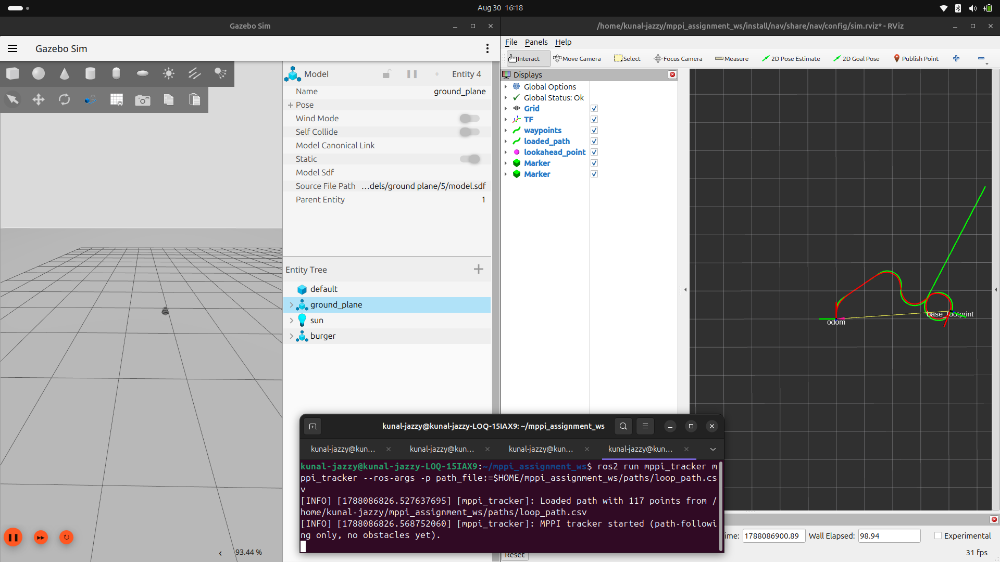

<p align="center">
  
</p>

<h1 align="center">MPPI Trajectory Tracker</h1>

<p align="center">
  
  
  
  
</p>

<p align="center">
A ROS2 MPPI controller that tracks a recorded path and avoids static and dynamic obstacles in real time.
</p>

<details>
<summary>📑 Contents</summary>

- [Demo](#demo)
- [Overview](#overview)
- [Quick Start](#quick-start)
- [Test Results](#test-results)
- [Code Reference](#code-reference)
- [How It Works](#how-it-works)
- [Notes](#notes)
- [Repository Structure](#repository-structure)

</details>

---

## Demo

| Case | Preview | Full video |
|---|---|---|
| **1. Straight + obstacle** |  | [Watch on Drive](https://drive.google.com/drive/folders/1r24bwaXrKvyS6vVTc_5Nz41_56nwCPC_?usp=sharing) |
| **2. Curved + obstacle** |  | [Watch on Drive](https://drive.google.com/drive/folders/1r24bwaXrKvyS6vVTc_5Nz41_56nwCPC_?usp=sharing) |
| **3. Two obstacles flanking the path** |  | [Watch on Drive](https://drive.google.com/drive/folders/1r24bwaXrKvyS6vVTc_5Nz41_56nwCPC_?usp=sharing) |
| **4. Self-crossing loop, no obstacles** |  | [Watch on Drive](https://drive.google.com/drive/folders/1r24bwaXrKvyS6vVTc_5Nz41_56nwCPC_?usp=sharing) |
| **Dynamic obstacle, dropped mid-run** |  | [Watch on Drive](https://drive.google.com/drive/folders/1r24bwaXrKvyS6vVTc_5Nz41_56nwCPC_?usp=sharing) |
| **Baseline — no obstacles** | — | [Watch on Drive](https://drive.google.com/drive/folders/1r24bwaXrKvyS6vVTc_5Nz41_56nwCPC_?usp=sharing) |

The previews above are plotted replays rendered straight from logged `/odom`, `/scan`, and `/cmd_vel` data — green is the recorded path, red is the actual driven path. 

---

## Overview

This replaces a reference Pure Pursuit controller with an MPPI implementation. The main design choice: path-tracking and obstacle avoidance are both terms in one cost function, not two separate behaviors. There's no "avoiding" mode and no "resuming" mode. Every control cycle scores about 500 sampled trajectories against a single combined score and the detour and rejoin behavior comes out of that scoring on its own.

| Component | What it does |
|---|---|
| `record_path` | Logs `(x, y)` from `/odom` to CSV at 0.1m spacing |
| `mppi_tracker` | Loads the CSV, drives the robot along it, avoids obstacles using live 360° LiDAR |

---

## Quick Start

```bash
# Terminal 1 [simulation]
export TURTLEBOT3_MODEL=burger
ros2 launch turtlebot3_gazebo empty_world.launch.py

# Terminal 2 [RViz]
ros2 run rviz2 rviz2
# Set Fixed Frame to "odom", then Add → By topic:
#   /mppi/recorded_path_marker  (green — recorded path)
#   /mppi/traversed_path_marker (red — actual driven path)
#   /scan, RobotModel

# Terminal 3 [record a path (use teleop to drive)]
ros2 run mppi_tracker record_path --ros-args -p output_file:=/tmp/my_path.csv

# Terminal 4 [track recorded path]
ros2 launch mppi_tracker mppi_tracker_launch.py path_file:=/tmp/my_path.csv
```

Note: don't use `nav`'s own `sim_bringup.py` for this — it also starts the reference Pure Pursuit node, which will fight the MPPI tracker for `/cmd_vel`.

All tuning listed in `config/mppi_params.yaml`.

---

## Test Results

| Case | Setup | Result |
|---|---|---|
| **1. Straight + obstacle** | One obstacle on a straight recorded path | Detours around it and rejoins the line, no contact |
| **2. Curved + obstacle** | Obstacle on a recorded curve | Tracks the curve, detours around the obstacle, rejoins |
| **3. Two obstacles flanking the path** | A cylinder on each side of the path, ~1.9m apart | Shifts to hold clearance and passes between them |
| **4. Self-crossing loop** | Loop path that crosses itself, no obstacles | Follows the whole loop through the crossing, no circling |

Dynamic obstacles: since the LiDAR scan is re-read fresh every 20Hz cycle with no caching, moving or newly-added obstacles get handled by the exact same code path as static ones.Check the [dynamic obstacle demo](#demo)

---

## How It Works


---

## Code Reference

<details>
<summary><b>Code Reference — what each function does</b></summary>
<br>

**`record_path.py`**
- `odom_callback()` — fires on every `/odom` message; checks distance from the last saved point and appends a new one to the CSV once it's moved 0.1m.

**`mppi_tracker.py`**
- `odom_callback()` / `scan_callback()` — just store the latest pose and LiDAR scan for the control loop to use.
- `get_obstacle_points_world()` — converts the raw LiDAR ranges/angles into actual (x, y) obstacle points in the world frame, filtered to a max range and downsampled for speed.
- `build_local_reference()` — walks forward along the recorded path from the current nearest point, stepping at the desired speed, to build the short-term target the rollout gets scored against.
- `rollout()` — takes a batch of sampled control sequences and simulates them forward through a differential-drive model to get predicted trajectories.
- `control_loop()` — the actual MPPI cycle: finds the nearest path point, builds the reference, samples trajectories, scores them (path + obstacle + control cost), takes the weighted average, publishes `/cmd_vel`, and shifts the sequence for next time.
- `publish_cmd()` — wraps a (v, w) pair into a `TwistStamped` and publishes it.

</details>

---

## Notes

<details>
<summary><b>Why one cost function instead of a stop-and-wait state machine</b></summary>
<br>

The reference implementation deals with obstacles through a hard rule: if something gets within 0.5m in a 120° cone in front of the robot, stop and wait. It's safe, but it can only do two things — move, or stop. There's no way for it to actually go around something.

MPPI doesn't need that split at all. Obstacle proximity is just one more thing added into the same cost that every candidate trajectory gets judged on:

```
total_cost = w_path × (deviation from local path reference)
           + w_obstacle × (proximity to LiDAR obstacle points)
           + w_control × (control effort)
```

If a trajectory clips an obstacle, it scores worse — no matter how well it was tracking the path otherwise. A trajectory that curves around the obstacle and comes back to the line scores well on both counts at once. Nothing ever explicitly decides "now avoid" and then separately decides "now resume" — it's the same weighted average, cycle after cycle. That's also the whole reason dynamic obstacles didn't need any extra code: the logic never knew the difference.
</details>

<details>
<summary><b>A bug I found during testing: self-intersecting paths caused infinite circling</b></summary>
<br>

**What happened:** on a path that looped back and crossed itself, the tracker would get stuck right at that crossing point, circling instead of pushing through.



**Why:** every cycle, the tracker looks for the closest point on the recorded path to where the robot actually is, and uses that to build its next reference. Right at a self-crossing, the robot's position ends up almost equally close to two totally different points on the path — one from before it entered the loop, one from partway through it. A simple "find the closest point anywhere on the path" search kept jumping between those two from one cycle to the next, so the reference kept flipping backward and forward instead of moving forward.

**Fix:** instead of searching the whole path every time, I made it only look in a small window just ahead of wherever it matched last cycle (with a bit of backward room built in, in case of noise). That keeps progress moving forward only — it can never jump back to an earlier point on the path, even one that looks close by. Getting the window size right took a bit of trial and error too. Too wide, and it would spot the far side of a tight loop too early and skip right over it. Too narrow, and the original back-and-forth came back. `nearest_search_window: 10` is what actually worked cleanly on the paths I tested.

Honestly, this turned out to be the most interesting bug in the whole project — the kind of thing that only shows up once your path has real complexity to it, not something you'd ever catch testing a straight line or a single curve.
</details>

<details>
<summary><b>A gotcha: /cmd_vel message type</b></summary>
<br>

Depending on the ROS2/Gazebo bridge setup, `/cmd_vel` can expect either `geometry_msgs/Twist` or `geometry_msgs/TwistStamped` — and publishing the wrong one doesn't throw an error, the robot just silently never moves. I hit this early on; the reference implementation publishes `Twist`, but this environment's bridge expects `TwistStamped`. Worth checking with `ros2 topic info /cmd_vel -v` before assuming your controller is broken.
</details>

<details>
<summary><b>Parameter tuning notes</b></summary>
<br>

A few of these numbers didn't work on the first try, and needed some real back-and-forth to land right:

- **`noise_std_v`** started out at 0.15, which is pretty aggressive against a 0.2 m/s desired speed. The problem was velocity gets clipped at 0 (can't reverse) but nothing clips it symmetrically on the top end, so this quietly pushed the average speed up over time. Brought it down to 0.08 and that went away.
- **`w_obstacle` / `safety_radius`** — at first the robot would visibly hesitate right at the moment it needed to commit to an avoidance move. Turns out that's a known thing with MPPI when two cost terms are close enough in size that neither one wins clearly. Cranked up `w_obstacle` so it clearly takes over once it kicks in, and the hesitation went away.
- **The tight-corridor spacing in Case 3** took some actual trial and error — finding the line between "too narrow, it can't get through without paying a cost" and "wide enough that it just doesn't care." Ended up around 1.9m between the two obstacle centers, given this robot's size and the safety margin I'm using.
- **`goal_tolerance`** was 0.15 to start, but every test run I did had the robot finishing somewhere around 0.145–0.150m from the goal — basically right on the edge of counting as "reached." Bumped it to 0.2 so there's actual room to spare.
- **`use_sim_time`** — I hadn't set this on the node at first. Under load, the control loop ended up timing itself against the wall clock instead of sim time, and that let the odometry drift away from what was actually true in the sim. Setting it fixed the drift.
</details>

<details>
<summary><b>Known limitations</b></summary>
<br>

- Each rollout treats the LiDAR obstacle snapshot as frozen for the whole prediction horizon (30 steps × 0.1s, so 3 seconds). Because the whole thing re-plans at 20Hz, this is fine for anything static or slow-moving — but if an obstacle suddenly shows up, it gets a noticeably tighter safety margin than a static one would. And the obstacle cost only really kicks in once something's within about 1.1m of the robot (roughly the 0.6m the rollout reaches ahead, plus the 0.45m safety radius).
- If the robot ever got completely boxed in, there's no real recovery move built in — it would just go with whichever sampled option scored least badly, not do anything deliberate to get itself unstuck.
- The local reference just steps forward along the recorded path at a fixed speed. There's no actual velocity smoothing for sharp turns beyond whatever the cost function naturally encourages.
- Worth being precise about the MPPI weighting here — it's a softmax over total cost, which is really more of a cross-entropy / path-integral hybrid than the full Williams et al. formulation. There's no explicit control-cost coupling in the cost-to-go. In practice, once the obstacle term takes over, it behaves close to greedy — which is honestly what I wanted for decisive avoidance, but it's worth calling that out rather than calling it "MPPI" without qualification.
</details>

<details>
<summary><b>What I'd do next with more time</b></summary>
<br>

- Actually add the full information-theoretic control-cost coupling term to the MPPI update, instead of the softmax-over-cost shortcut I'm using now.
- Get the controller to actively center itself when it's threading a symmetric gap between two obstacles, instead of just slowing down and accepting "safe enough." Right now it doesn't try to maximize its margin, just stay clear of it.
- Build a real recovery behavior for when the robot ends up fully boxed in, instead of just defaulting to whichever sampled option happened to score the least badly.
</details>

---

## Repository Structure

```
mppi_tracker/
├── config/
│   └── mppi_params.yaml       # all tuned parameters
├── launch/
│   └── mppi_tracker_launch.py
├── paths/                     # sample recorded paths (CSV, 0.1m spacing)
│   ├── test_path.csv
│   ├── loop_path.csv
│   └── curve_path.csv
├── mppi_tracker/
│   ├── record_path.py
│   └── mppi_tracker.py
├── media/                     # GIF previews and screenshots (full videos on Drive, see Demo)
├── README.md
├── package.xml
└── setup.py
```

---

## Author
Kunal Yadav